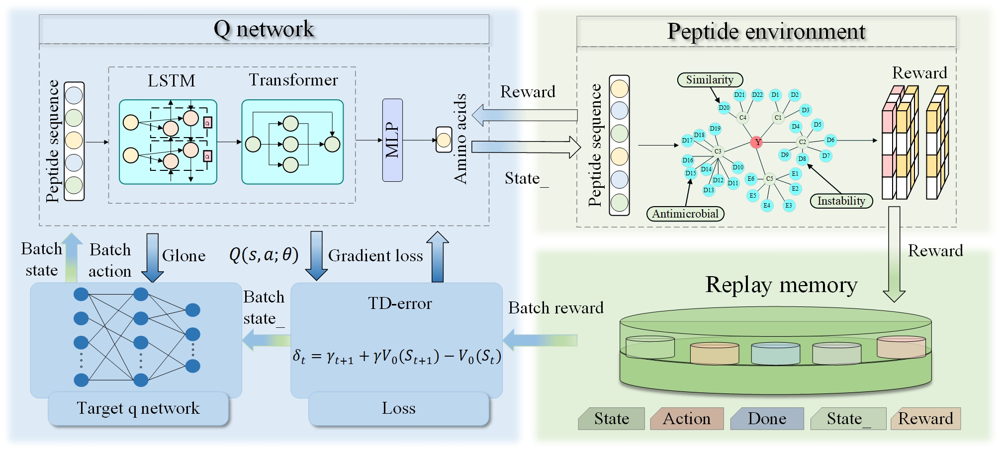

# MOIRL Multi-Objective Inverse Reinforcement Learning-Driven Model

### Codes, datasets and appendix for BIBM-2025 paper "A Multi-Objective Inverse Reinforcement Learning-Driven Model for Therapeutic Peptide Generation"

## Overview of MOIRL 


### The repository is organized as follows

- `data/` contains the datasets used in the MOIRL model;
- `Env/` contains the environment of herapeutic peptide generation;
- `Models/` contains the implementation of the RF model;
- `Outputs/` contains the output peptide data , etc;
- `rl_algorithm/` contains the reninforce learning algorithm;
- `scripts/` contains the interaction between peptide generation environment and agent;
- `utils/` contains the bio-function tools for evaluation;
---

### Run code

For how to run MOIRL, we present an example based on the AMP dataset, which could be easy extend to other peptide datasets.
1. Download the AMP dataset with fasta files for sequences. Then place the files in the specified folder. Due to the large amount of training data required for the model, we upload the source data to Google cloud drive with the resource link (https://drive.google.com/file/d/1PmUFzdTlxFoEcODHqyWPgwJmG4B01lEG/view?usp=drive_link)
- `data/`
  + `source/`
      + `fasta/`: `AMP.fasta`, `nonAMP.fasta`
      + `pdb/`: `AMP/` pdb files for AMP, `nonAMP/` pdb files for nonAMP
      + `aaindex.csv` parameter of amino acid from aaindex
2. Training for MOIRL model with the AMP dataset
```
python train.py --n_max_epochs 500 --n_timestep 1000 --./Outputs
```
